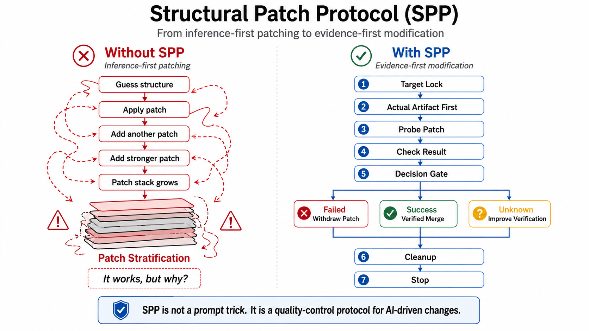

# Structural Patch Protocol (SPP)

> A quality-control protocol for AI-driven changes to existing artifacts.

**Structural Patch Protocol (SPP)** is a lightweight protocol for preventing AI agents from making inference-based erroneous changes to existing artifacts.

SPP converts AI-driven patching from **inference-first generation** into **evidence-first modification**.

```text
SPP is not a prompt trick.
SPP is a quality-control protocol for AI-driven changes.
```


---

## What is SPP?

AI agents increasingly modify existing software and design artifacts: code, database schemas, API calls, UI components, CSS, configuration files, prompts, documents, and generated assets.

They are fast, but they often fail in two recurring ways:

1. They patch an artifact before inspecting the actual artifact.
2. They stack ineffective patches until something appears to work.

SPP defines a simple operational discipline for avoiding these failures:

```text
Target Lock
→ Actual Artifact First
→ Probe Patch
→ Verify
→ Failed Patch Withdrawal / Verified Merge
→ Cleanup
→ Stop
```

In short:

```text
Inspect the real artifact.
Try one small patch.
Verify whether it worked.
Withdraw failed patches.
Merge only verified transformations.
Clean up ineffective layers.
Stop at a stable point.
```

---

## Three Differentiators

### 1. Evidence before inference

SPP does not allow an agent to modify an existing artifact based only on naming conventions, previous notes, expected schemas, or guessed structure.

```text
Design notes are not evidence.
Previous sprint notes are not evidence.
Naming conventions are not evidence.
The artifact itself is evidence.
```

### 2. One probe, one verification, one decision

A Probe Patch is not an invitation to accumulate trial-and-error layers.

After one Probe Patch, the agent must decide:

```text
Success → proceed to Verified Merge
Failure → withdraw the patch before trying another one
Unknown → improve verification before continuing
```

### 3. No unverified patch stacking

SPP prohibits stacking patches until one appears to work.

```text
Failed Probe Patch must be withdrawn before the next patch.
A passing result after stacked patches is not considered a verified fix.
```

This rule is especially important in AI-assisted UI and CSS work, where later selectors, stronger declarations, or last-write-wins behavior may hide ineffective earlier patches.

---

## What SPP Is Not

SPP is not a general-purpose coding style guide.

SPP is not a replacement for tests, review, or version control.

SPP is not limited to source code.

SPP is not a prompt template or prompt-engineering trick.

SPP is a protocol for controlling **how an AI agent modifies an existing artifact** after a target has been identified.

---

## How SPP Works

### 1. Target Lock

Before modifying anything, the agent must identify the target.

A target may be a file, function, class, component, route, database table, schema, selector, UI block, configuration entry, prompt, document section, or generated artifact.

When available, SPP should use SAI or an equivalent structural address to lock the target.

### 2. Actual Artifact First

Before changing an existing artifact, the agent must inspect the actual artifact.

Examples:

```text
Files:     ls, find, tree, open the file
DB:        SHOW TABLES, DESCRIBE <table>, inspect actual DB path
API:       inspect schema, actual response, tests, version
CSV/JSON:  inspect header, keys, sample rows
UI:        inspect DOM, selectors, rendered behavior
Config:    inspect actual config and environment variable names
```

### 3. Probe Patch

The agent applies one minimal patch to test whether the intended modification is valid.

The Probe Patch should be small enough to revert, inspect, and explain.

### 4. Verify

The agent verifies whether the Probe Patch produced the expected effect.

Verification may include tests, type checks, builds, UI confirmation, database queries, API responses, logs, screenshots, diffs, or human review.

### 5. Failed Patch Withdrawal

If the Probe Patch fails, the agent must withdraw or explicitly resolve it before applying another patch.

```text
No second patch before resolving the first failed patch.
```

### 6. Verified Merge

Only a transformation that has been verified on a Probe Patch may be applied to structurally matching targets.

```text
Do not generalize from similarity alone.
Only apply verified transformations to structurally matching targets.
```

### 7. Cleanup Gate

Before stopping, the agent must remove obsolete, superseded, ineffective, or unexplained patch layers.

```text
Cleanup is not deletion.
Cleanup is reconstruction of the currently effective structure into a canonical form.
```

### 8. Stop Rule

When the target is fixed, verification has passed, ineffective patches have been withdrawn, and the diff is within scope, the agent must stop.

Adjacent issues should be recorded as follow-up tasks.

---

## Domain Neutrality

SPP is not limited to source code.

It can be applied to:

- code modification;
- database schema reference;
- API integration;
- JSON / CSV schema handling;
- UI / DOM / CSS modification;
- configuration files;
- prompts;
- documentation;
- generated artifacts;
- design assets.

The first concrete use case in this repository is AI-assisted code modification:

- [`use-cases/code/AI-Code-Patch-Protocol.md`](use-cases/code/AI-Code-Patch-Protocol.md)

---

## Failure Cases

This repository starts with two motivating cases.

### Case A: Actual Artifact Violation

- [`DEV-PROTOCOL-CASE-DB-001`](examples/failure-cases/DEV-PROTOCOL-CASE-DB-001.md)

An AI agent inferred database file names, table names, or column names before inspecting the actual schema.

This case motivates the **Actual Artifact First Gate**.

### Case B: Patch Stratification

- [`DEV-PROTOCOL-CASE-PATCH-STACK-001`](examples/failure-cases/DEV-PROTOCOL-CASE-PATCH-STACK-001.md)

Repeated CSS, JavaScript, and HTML patches accumulated during AI-assisted UI development, making it unclear which declarations or functions controlled the final UI.

This case motivates **Failed Patch Withdrawal** and **Cleanup Gate**.

---

## Relation to SAI

SPP is designed to work with SAI:

```text
SAI = what to touch
SPP = how to safely touch it
```

SAI identifies and locks the target.  
SPP controls the modification process after the target has been identified.

SAI repository: [`StateToolsLab/sai-protocol`](https://github.com/StateToolsLab/sai-protocol)

See:

- [`docs/relation-to-sai.md`](docs/relation-to-sai.md)

---

## OSS Compatibility

SPP is designed to be lightweight enough for open-source repositories.

It can be used as:

- a repository policy;
- an AI agent instruction;
- a pull request checklist;
- a cleanup protocol;
- a coding-agent operation profile;
- a documentation standard for AI-assisted changes.

A minimal agent instruction is:

```text
Before modifying an existing artifact:
1. Lock the target.
2. Inspect the actual artifact.
3. Apply one minimal Probe Patch.
4. Verify the effect.
5. If it fails, withdraw it before trying another patch.
6. If it succeeds, merge only verified transformations.
7. Remove obsolete or ineffective layers.
8. Stop when stable.
```

---

## Repository Contents

```text
structural-patch-protocol/
├─ README.md
├─ LICENSE
├─ spec/
│  └─ Structural-Patch-Protocol.md
├─ docs/
│  ├─ failure-modes.md
│  └─ relation-to-sai.md
├─ examples/
│  └─ failure-cases/
│     ├─ DEV-PROTOCOL-CASE-DB-001.md
│     └─ DEV-PROTOCOL-CASE-PATCH-STACK-001.md
├─ use-cases/
│  └─ code/
│     └─ AI-Code-Patch-Protocol.md
├─ templates/
│  ├─ spp-checklist.md
│  ├─ spp-run-log.md
│  └─ patch-request.md
├─ agents/
│  └─ AGENTS.md
└─ paper/
   ├─ README.md
   ├─ status.md
   ├─ summary-en.md
   └─ summary-ja.md
```

---

## Paper

The formal paper for Structural Patch Protocol (SPP) is under preparation.

For now, this repository includes paper-facing summaries and status notes:

- [`paper/README.md`](paper/README.md)
- [`paper/status.md`](paper/status.md)
- [`paper/summary-en.md`](paper/summary-en.md)
- [`paper/summary-ja.md`](paper/summary-ja.md)

The GitHub repository is the working home of the protocol specification.  
The citable preprint version will be linked here after publication.

---

## Status

Draft v0.1.

This repository is prepared as a public working specification. Terms, examples, and templates may evolve as additional AI-assisted development cases are documented.

---

## License

MIT License.

See [`LICENSE`](LICENSE).

---

# Structural Patch Protocol (SPP) 日本語版

> AIによる変更作業の品質管理プロトコル。

**Structural Patch Protocol (SPP)** は、AIエージェントが既存成果物を推論で直接改変し、もっともらしいが誤ったパッチを当てることを防ぐための軽量プロトコルです。

SPPは、AIによる変更作業を **「推論先行の生成」** から **「証拠先行の変更」** へ変換します。

```text
SPPはプロンプト術ではない。
AIによる変更作業の品質管理プロトコルである。
```

---

## SPPとは何か

AIエージェントは、コード、DBスキーマ、API、UI、CSS、設定ファイル、プロンプト、文書、生成物などを高速に変更できます。

一方で、AI支援開発では次の二つの失敗が頻発します。

1. 実物を確認する前に、推論で既存成果物を変更する。
2. 効かなかったパッチを撤回せず、効くまで重ねる。

SPPは、この二つの失敗を防ぐために、以下の変更手順を定義します。

```text
Target Lock
→ Actual Artifact First
→ Probe Patch
→ Verify
→ Failed Patch Withdrawal / Verified Merge
→ Cleanup
→ Stop
```

短く言えば、次の手順です。

```text
実物を見る。
小さく一回試す。
効いたか確認する。
効かなかったパッチは取り下げる。
確認済みの変換だけを統合する。
不要なパッチ層をクリーンアップする。
安定点で止まる。
```

---

## 3つの特徴

### 1. 推論より証拠を優先する

SPPでは、命名慣習、前工程のメモ、想定スキーマ、過去の会話だけを根拠に既存成果物を変更してはいけません。

```text
設計メモは証拠ではない。
前Sprint報告は証拠ではない。
命名慣習は証拠ではない。
実物だけが証拠である。
```

### 2. 一試行、一検証、一判断

Probe Patchは、試行錯誤のパッチを積み上げるためのものではありません。

一つのProbe Patchを当てたら、AIエージェントは次のいずれかを判断します。

```text
成功 → Verified Mergeへ進む
失敗 → 次のパッチの前に取り下げる
不明 → 続行せず、検証方法を直す
```

### 3. 未検証パッチの積層を禁止する

SPPでは、効くまでパッチを積み重ねることを禁止します。

```text
失敗したProbe Patchは、次のパッチを当てる前に取り下げる。
積層後に通った結果は、検証済み修正とは見なさない。
```

これは、CSS、UI、HTML、設定、状態管理のように、後勝ち、強いセレクタ、優先順位によって「たまたま効いたように見える」領域で特に重要です。

---

## SPPではないもの

SPPは、一般的なコーディング規約ではありません。

SPPは、テスト、レビュー、バージョン管理の代替ではありません。

SPPは、コード専用ではありません。

SPPは、プロンプトテンプレートやプロンプトエンジニアリング術ではありません。

SPPは、対象が特定された後に、**AIエージェントが既存成果物をどう安全に変更するか** を制御するプロトコルです。

---

## SPPの動作

### 1. Target Lock

変更前に、AIエージェントは対象を固定します。

対象は、ファイル、関数、クラス、コンポーネント、ルート、DBテーブル、スキーマ、セレクタ、UIブロック、設定項目、プロンプト、文書セクション、生成物などです。

利用可能な場合、SPPはSAIまたは同等の構造住所によって対象を固定します。

### 2. Actual Artifact First

既存成果物を変更する前に、AIエージェントは必ず実物を確認します。

例：

```text
ファイル:    ls, find, tree, 実ファイルの確認
DB:          SHOW TABLES, DESCRIBE <table>, 実DBパス確認
API:         schema, 実レスポンス, テスト, バージョン確認
CSV/JSON:    header, key, サンプル行確認
UI:          DOM, selector, 実表示確認
Config:      実設定ファイルと環境変数名確認
```

### 3. Probe Patch

AIエージェントは、意図した変更が妥当かどうかを確認するために、最小のパッチを一つだけ当てます。

Probe Patchは、戻せる、確認できる、説明できる大きさでなければなりません。

### 4. Verify

AIエージェントは、Probe Patchが期待した効果を出したか確認します。

検証には、テスト、型チェック、ビルド、UI確認、DBクエリ、APIレスポンス、ログ、スクリーンショット、diff、人間レビューなどを使えます。

### 5. Failed Patch Withdrawal

Probe Patchが失敗した場合、AIエージェントは次のパッチを当てる前に、そのパッチを取り下げるか、明示的に解決しなければなりません。

```text
最初の失敗パッチを解決する前に、二つ目のパッチを当ててはならない。
```

### 6. Verified Merge

Probe Patchで検証済みの変換だけを、構造的に同型の対象へ展開できます。

```text
似ているだけで一般化してはならない。
確認済みの変換だけを、構造的に一致する対象へ適用する。
```

### 7. Cleanup Gate

停止前に、AIエージェントは古いパッチ、上書き済みパッチ、効いていないパッチ、理由不明のパッチ層を取り除きます。

```text
Cleanupは削除作業ではない。
Cleanupは、現在の有効構造をcanonical formへ再構成する作業である。
```

### 8. Stop Rule

対象が修正され、検証が通り、効かなかったパッチが取り下げられ、差分がスコープ内に収まったら、AIエージェントは停止します。

隣接課題はfollow-upとして記録します。

---

## ドメイン中立性

SPPはコード専用ではありません。

次のような対象に適用できます。

- コード修正
- DBスキーマ参照
- API接続
- JSON / CSV schema
- UI / DOM / CSS修正
- 設定ファイル
- プロンプト
- ドキュメント
- 生成物
- デザインアセット

本リポジトリの最初の具体ユースケースは、AI支援コード変更です。

- [`use-cases/code/AI-Code-Patch-Protocol.md`](use-cases/code/AI-Code-Patch-Protocol.md)

---

## 失敗ケース

本リポジトリでは、最初に二つの代表ケースを扱います。

### Case A: Actual Artifact Violation

- [`DEV-PROTOCOL-CASE-DB-001`](examples/failure-cases/DEV-PROTOCOL-CASE-DB-001.md)

AIエージェントが実DBスキーマを確認する前に、DBファイル名、テーブル名、カラム名を推論し、実在しない構造を前提に修正したケースです。

このケースは **Actual Artifact First Gate** の必要性を示します。

### Case B: Patch Stratification

- [`DEV-PROTOCOL-CASE-PATCH-STACK-001`](examples/failure-cases/DEV-PROTOCOL-CASE-PATCH-STACK-001.md)

AI支援UI開発において、CSS、JavaScript、HTMLの局所パッチが積層し、最終的にどの宣言や関数がUIを支配しているのか分かりにくくなったケースです。

このケースは **Failed Patch Withdrawal** と **Cleanup Gate** の必要性を示します。

---

## SAIとの関係

SPPは、SAIと組み合わせて使うことを想定しています。

```text
SAI = 何を触るか
SPP = どう安全に触るか
```

SAIは対象を特定し、固定します。  
SPPは、対象特定後の変更プロセスを制御します。

SAIリポジトリ: [`StateToolsLab/sai-protocol`](https://github.com/StateToolsLab/sai-protocol)

関連：

- [`docs/relation-to-sai.md`](docs/relation-to-sai.md)

---

## OSS互換性

SPPは、オープンソースリポジトリにも導入しやすい軽量プロトコルとして設計されています。

SPPは次の用途に使えます。

- リポジトリ運用ポリシー
- AIエージェント向け指示
- Pull Requestチェックリスト
- Cleanupプロトコル
- coding agent operation profile
- AI支援変更の記録標準

最小指示は次の通りです。

```text
既存成果物を変更する前に：
1. 対象を固定する。
2. 実物を確認する。
3. 最小のProbe Patchを一つ当てる。
4. 効果を検証する。
5. 失敗した場合は、次のパッチ前に取り下げる。
6. 成功した場合は、確認済みの変換だけを統合する。
7. 古いパッチ層や効いていないパッチ層を取り除く。
8. 安定したら止まる。
```

---

## リポジトリ内容

```text
structural-patch-protocol/
├─ README.md
├─ LICENSE
├─ spec/
│  └─ Structural-Patch-Protocol.md
├─ docs/
│  ├─ failure-modes.md
│  └─ relation-to-sai.md
├─ examples/
│  └─ failure-cases/
│     ├─ DEV-PROTOCOL-CASE-DB-001.md
│     └─ DEV-PROTOCOL-CASE-PATCH-STACK-001.md
├─ use-cases/
│  └─ code/
│     └─ AI-Code-Patch-Protocol.md
├─ templates/
│  ├─ spp-checklist.md
│  ├─ spp-run-log.md
│  └─ patch-request.md
├─ agents/
│  └─ AGENTS.md
└─ paper/
   ├─ README.md
   ├─ status.md
   ├─ summary-en.md
   └─ summary-ja.md
```

---

## Paper

Structural Patch Protocol (SPP) の正式な論文は準備中です。

現時点では、論文化に向けたサマリーとステータスを以下に置いています。

- [`paper/README.md`](paper/README.md)
- [`paper/status.md`](paper/status.md)
- [`paper/summary-en.md`](paper/summary-en.md)
- [`paper/summary-ja.md`](paper/summary-ja.md)

GitHubリポジトリは、更新されるプロトコル仕様の作業場所です。  
引用可能なpreprint版は、公開後にここへリンクします。

---

## Status

Draft v0.1.

本リポジトリは、公開作業仕様として準備されています。用語、事例、テンプレートは、今後のAI支援開発ケースに応じて更新される可能性があります。

---

## License

MIT License.

詳細は [`LICENSE`](LICENSE) を参照してください。
